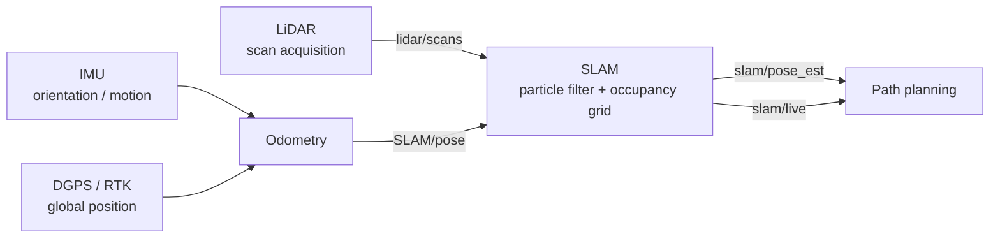

# Autonomous Rover Navigation

A multi-sensor navigation stack for an autonomous ground rover: LiDAR, IMU and DGPS/RTK
acquisition feeding a particle-filter SLAM module that estimates rover pose and builds an
occupancy grid map for the path planning system.

Built as an M.Sc. project at Hochschule Bremerhaven. The modules communicate over MQTT and
were validated in simulation and in live outdoor test campaigns.

---

## System overview



Each sensor module handles acquisition, message formatting and time alignment onto a common
timebase. The SLAM module consumes scans and odometry, estimates pose, maintains the map, and
publishes both for downstream consumers.

---

## Repository structure

| Path | Contents |
|------|----------|
| `Lidar/` | LiDAR acquisition and scan preprocessing |
| `IMU/` | IMU acquisition and orientation data handling |
| `DGPS/` | DGPS / RTK acquisition and global position handling |
| `SLAM/` | Particle-filter localization, occupancy grid mapping, offline map generation |

> **TODO — fill these in.** For each of `Lidar/`, `IMU/` and `DGPS/`: list the actual script
> names, say which hardware or driver they talk to, what message format they publish, what
> MQTT topic they publish on, and the sample rate. The SLAM section below is the level of
> detail to aim for. Delete this note once done.

---

## SLAM

Two modules: one for real-time localization and mapping while the rover is moving, one for
offline map reconstruction from recorded scans.

| File | Purpose |
|------|---------|
| `SLAM_LIVE_FINAL.py` | Real-time SLAM with MQTT interface |
| `Static_map.py` | Offline map generation from recorded LiDAR scans |
| `static_map.png` | Occupancy grid produced by the static mapping module |

### Live SLAM

Monte Carlo localization (particle filter) over LiDAR scans, running the standard
predict–update–resample cycle each iteration:

1. Receive LiDAR scan and rover odometry pose
2. **Predict** — propagate every particle through the motion model with added noise
3. **Update** — weight each particle by how well its projected scan endpoints align with the map
4. **Resample** — when the effective particle number falls below threshold
5. **Estimate** — pose as the weighted mean of all particles
6. **Map** — update the occupancy grid
7. **Publish** — pose and map over MQTT

**Motion model** (SE(2) rigid-body update):

```
x' = x + cos(θ)·Δx − sin(θ)·Δy
y' = y + sin(θ)·Δx + cos(θ)·Δy
θ' = θ + Δθ
```

Particles are initialised around the starting pose with Gaussian noise on `x`, `y` and `θ`.
Noise is added during prediction to represent odometry uncertainty.

**Resampling criterion** — the effective particle number:

```
N_eff = 1 / Σ(wᵢ²)
```

Resampling is triggered when `N_eff` drops below a configured threshold, which avoids
degenerate particle sets without resampling on every step.

**Pose estimate** — weighted mean, with the heading averaged correctly through its components
rather than by averaging angles directly:

```
x̂ = Σ(wᵢ·xᵢ)
ŷ = Σ(wᵢ·yᵢ)
θ̂ = atan2( Σ(wᵢ·sin θᵢ), Σ(wᵢ·cos θᵢ) )
```

### Occupancy grid mapping

| Parameter | Value |
|-----------|-------|
| Map size | 30 m × 30 m |
| Resolution | 0.05 m / cell |
| Grid | 600 × 600 cells |

Cells store occupancy in log-odds form, `L = log(p / (1 − p))`, so updates are additive:

```
free cell:     L ← L + LOG_FREE
occupied cell: L ← L + LOG_OCC
```

Values are clipped to fixed bounds to keep the map numerically stable and to stop cells
saturating so hard that they can never be revised.

### MQTT interface

**Subscribes**

| Topic | Payload |
|-------|---------|
| `SLAM/pose` | Rover odometry pose |
| `lidar/scans` | LiDAR scan data |

**Publishes**

| Topic | Payload |
|-------|---------|
| `slam/pose_est` | Estimated rover pose |
| `slam/live` | Occupancy grid map |

Pose message:

```json
{
  "x_m": 12.4,
  "y_m": 7.8,
  "theta_rad": 1.57,
  "timestamp_ms": 123456,
  "pose_valid": true,
  "neff": 42.3,
  "frame": "bottom_left_0_0"
}
```

`pose_valid` and `neff` are published alongside the estimate so a consumer can distinguish a
confident fix from a filter that has lost track, rather than treating every pose as equally
trustworthy.

### Coordinate frames

The SLAM module works internally in a **centred** Cartesian frame with the origin at the
middle of the grid (left negative x, right positive x, bottom negative y, top positive y).

Before publishing, poses are converted into a **bottom-left origin** frame so the grid-based
path planner can use the values directly. The `frame` field in the pose message names which
convention the message is in.

### Static map generation

`Static_map.py` rebuilds a global map offline from recorded LiDAR scans. No MQTT, no particle
filter — motion is estimated directly from the scans:

1. Load scans from a JSON dataset
2. Convert polar `(r, θ)` to Cartesian `x = r·cos θ`, `y = r·sin θ`
3. Estimate pose by correlative scan matching
4. Refine with ICP
5. Update the occupancy grid
6. Save the map

**Correlative scan matching** searches around the previous pose estimate in two stages:

| Stage | Translation | Rotation |
|-------|-------------|----------|
| Coarse | ±0.45 m | ±10° |
| Fine | ±0.15 m | ±3° |

The pose giving the minimum distance error between scan points and the map is selected.

**ICP refinement** then minimises the alignment residual between scan points and map points:

```
Σ ‖ R·pᵢ + t − qᵢ ‖²
```

This module is also how mapping changes were validated — it reprocesses recorded datasets, so
a result can be reproduced at a desk instead of re-driving the rover.

---

## Getting started

### Requirements

```bash
pip install numpy scipy opencv-python paho-mqtt
```

> **TODO** — add a `requirements.txt` with pinned versions and replace the above with
> `pip install -r requirements.txt`. Note the Python version you developed against.

### Running

```bash
# Real-time SLAM (requires an MQTT broker and live sensor streams)
python SLAM/SLAM_LIVE_FINAL.py

# Offline map generation from a recorded dataset
python SLAM/Static_map.py
```

> **TODO** — document how to point `Static_map.py` at a dataset, and include a small sample
> recording in the repo so someone can run it without the rover. This single change is what
> turns the repo from "code I wrote" into "something a reader can actually execute."

---

## Results


Occupancy grid reconstructed offline from recorded LiDAR scans using correlative scan matching
with ICP refinement.

> **TODO** — check this image path matches where `static_map.png` actually sits. Consider
> adding a second figure showing the live map plus estimated trajectory.

---

## Known limitations

Stated plainly, because they bound what the results mean:

**Live SLAM**
- No loop closure detection
- No global pose-graph optimisation
- Localization accuracy depends on particle filter tuning

**Static mapping**
- Drift accumulates over long trajectories
- Requires sufficient scan overlap between consecutive frames
- No global optimisation

---

## Future work

- Loop closure detection and pose-graph optimisation
- IMU fusion into the estimator, rather than relying on odometry alone
- Adaptive particle filter tuning
- Real-time map optimisation
- ROS 2 port
- Dynamic obstacle handling

---

## Author

**Chandrasekhar Moravaneni** — M.Sc. Embedded Systems Design, Hochschule Bremerhaven
[GitHub](https://github.com/chandrasekharmoravaneni) ·
[LinkedIn](https://linkedin.com/in/chandra-sekhar-moravaneni-8229b0214)

> **TODO** — this was a group project. Add a line stating which parts are your work and
> crediting teammates for theirs. Reviewers notice when scope is clear, and they notice when
> it isn't.
